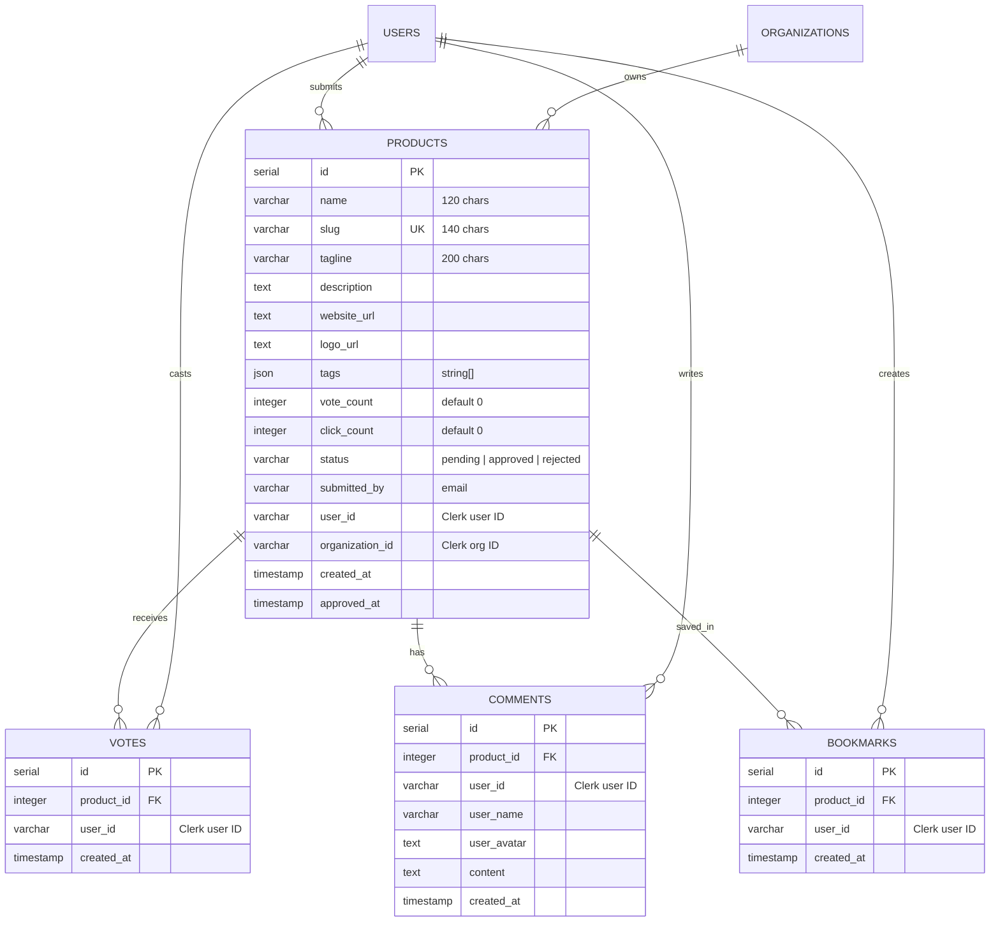

# iBuiltThis

> A premier community launchpad and showcase platform for creators, makers, and indie developers to share their apps, AI tools, SaaS products, and side projects with the world.


---

## Table of Contents

- [Overview](#overview)
- [Key Features](#key-features)
- [Tech Stack](#tech-stack)
- [Architecture & Next.js 16 Highlights](#architecture--nextjs-16-highlights)
- [Database Schema](#database-schema)
- [Project Structure](#project-structure)
- [Getting Started](#getting-started)
  - [Prerequisites](#prerequisites)
  - [Installation](#installation)
  - [Environment Configuration](#environment-configuration)
  - [Database Setup & Seeding](#database-setup--seeding)
  - [Running the Development Server](#running-the-development-server)
- [Configuring Admin Access](#configuring-admin-access)
- [Available Scripts](#available-scripts)
- [Contributing & License](#contributing--license)

---

## Overview

**iBuiltThis** is a modern, high-performance web platform where makers can launch their creations, collect genuine community feedback, gain visibility, and explore what fellow developers are building.

The application is engineered with an ultra-clean, minimalist aesthetic and leverages modern React Server Components, Next.js 16 component caching, optimistic UI updates, atomic PostgreSQL transactions, and Clerk multi-tenant organization scoping.

---

## Key Features

### 🚀 Product Discovery & Search
- **Curated Feeds**: Hero section with real-time platform statistics (total projects, community votes, active creators), followed by **Featured Products** and **Recently Launched** feeds.
- **Product Explorer (`/explore`)**: Comprehensive search with multi-field filtering across product title, tagline, description, and tags.
- **Dynamic Category Filtering**: Dynamically extracted category pills sorted by tag frequency with real-time product counts.
- **Multi-criteria Sorting**: Sort launches effortlessly between **Trending** (highest vote count) and **Recent** (newest submissions).

### ⚡ Engagement & Community
- **Optimistic Upvoting/Downvoting**: Instant, latency-free vote toggling powered by React context (`VoteProvider`) with rollback protection and Sonner notifications.
- **Personal Bookmarks (`/bookmarks`)**: Save and organize favorite projects into a personal collection with global state synchronization (`BookmarkProvider`).
- **Discussion & Comments (`/products/[slug]`)**: Interactive discussion threads on product detail pages with character limits, maker/user avatars, and authorization-guarded comment deletion.
- **Outbound Click Tracking**: Direct product website visits (`VisitWebsiteButton`) trigger server-side analytics with **24-hour cookie-based deduplication** (`ibuildthis_clicked_products`) to prevent artificial click inflation.
- **Native Social Sharing**: Native Web Share API integration with automatic fallback to clipboard URL copying.

### 👤 Maker Portfolios (`/makers/[userId]`)
- Dedicated creator profile pages showcasing builder statistics:
  - Total products launched
  - Total community upvotes earned
  - Cumulative outbound visits driven
  - Platform join date and Clerk profile avatar
- Complete catalog of approved products submitted by the maker.

### 🛠️ Product Submission & Management
- **Submission Pipeline (`/submit`)**: Multi-step submission form with strict Zod validation (name, slug format, tagline, description, URL checks, tags).
- **Logo Uploads via Cloudinary**: Direct file upload with automated image transformations (400x400 auto-crop, format & quality optimization) or direct URL fallback.
- **Maker Dashboard (`/my-products`)**: Track status badges (`pending`, `approved`, `rejected`), live vote and click counts.
- **Edit Sheet**: Update existing project details or replace logos at any time; editing automatically resets the product to `pending` status for admin review.
- **Deletion Controls**: Secure, ownership-verified deletion for creators and organization owners.

### 🏢 Team & Organization Support
- **Clerk Organizations**: Built-in support for team collaboration and launches.
- **Automated Workspace Onboarding (`/org-setup`)**: Automatically provisions and switches active organizations for new users.
- **Submission Organization Picker**: Choose whether to submit products personally or under an organization.
- **Embedded Organization Switcher**: Directly embedded within Clerk's User Profile modal.

### 🛡️ Admin Moderation Portal (`/admin`)
- **Metadata-Guarded Access**: Restricted to accounts flagged with `isAdmin: true` in Clerk public metadata.
- **Moderation Dashboard**: Overview cards for approved, pending review, and rejected submissions.
- **Review Controls**: One-click actions to **Approve**, **Reject**, or **Delete** products across the platform.

---

## Tech Stack

| Layer | Technology | Details |
| :--- | :--- | :--- |
| **Framework** | [Next.js 16.2.3](https://nextjs.org/) | App Router, Server Actions, Turbopack |
| **Library** | [React 19.2.4](https://react.dev/) | React Server Components, Suspense, Server Actions |
| **Language** | [TypeScript 5](https://www.typescriptlang.org/) | Strict type checking, end-to-end type safety |
| **Styling** | [Tailwind CSS v4](https://tailwindcss.com/) | `@tailwindcss/postcss`, CSS variables design tokens |
| **UI Components** | [Shadcn UI](https://ui.shadcn.com/) / [Radix UI](https://www.radix-ui.com/) | Accessible primitives, Sheet, Dialog, Dropdown, Badges |
| **Icons & Feedback** | [Lucide React](https://lucide.dev/) & [Sonner](https://sonner.emilkowal.ski/) | Clean iconography and rich toast alerts |
| **Typography** | [Google Fonts](https://fonts.google.com/) | `Outfit` & `Inter` |
| **Authentication** | [Clerk](https://clerk.com/) (`@clerk/nextjs` v7) | Auth, Organizations, Custom user buttons, RBAC |
| **Database** | [Neon](https://neon.tech/) PostgreSQL | Serverless Postgres via `@neondatabase/serverless` |
| **ORM** | [Drizzle ORM](https://orm.drizzle.team/) | Type-safe queries, relations, migrations (`drizzle-kit`) |
| **Media Storage** | [Cloudinary](https://cloudinary.com/) | Cloud storage & image processing for logos |
| **Validation** | [Zod](https://zod.dev/) | Safe parse schemas for forms and server action payloads |

---

## Architecture & Next.js 16 Highlights

- **Component-Level Caching (`"use cache"`)**: Static and shell components take advantage of Next.js 16's `cacheComponents: true` config and `"use cache"` directive for near-instant response times on cached queries (`getFeaturedProducts`, `getAllApprovedProducts`, `getProductBySlug`, `getPlatformStats`).
- **Dynamic Connection Boundaries**: Dynamic, user-specific data fetching (such as maker profiles, user products, and bookmarks) explicitly utilizes `await connection()` from `next/server` to maintain crisp static/dynamic boundary separation.
- **Edge Proxy Middleware (`proxy.ts`)**: Centralized request interception verifying session status, auto-redirecting unauthenticated users from protected routes (`/submit`, `/admin`, `/my-products`), handling organization workspace redirection, and verifying admin privileges.
- **Atomic Database Transactions**: Voting actions execute inside Drizzle database transactions to atomically maintain `votes` relations and update cached `voteCount` counters (`GREATEST(0, vote_count - 1)`).
- **Expanded Server Action Limits**: Configured `experimental.serverActions.bodySizeLimit: "10mb"` in `next.config.ts` to seamlessly accommodate high-resolution logo uploads.

---

## Database Schema

The database model is defined in `db/schema.ts` using Drizzle ORM:



### Table Details & Indexes
- **`products`**: Unique index on `slug`, performance index on `status` and `organization_id`. Cascading deletes linked to votes, comments, and bookmarks.
- **`votes`**: Unique compound index on `(user_id, product_id)` to enforce a single vote per user per product.
- **`comments`**: Indexes on `product_id`, `user_id`, and `created_at` for high-throughput comment loading and chronological sorting.
- **`bookmarks`**: Unique compound index on `(user_id, product_id)` to prevent duplicate saves.

---

## Project Structure

```
├── app/
│   ├── admin/                 # Admin review & moderation portal
│   ├── bookmarks/             # User's saved products feed
│   ├── explore/               # Search, filter, and discovery page
│   ├── makers/[userId]/       # Public creator profile & metrics
│   ├── my-products/           # Maker submission management & edit sheets
│   ├── org-setup/             # Clerk Organization onboarding & switcher logic
│   ├── products/
│   │   └── [slug]/            # Product detail view, comments, and actions
│   ├── sign-in/ [[...sign-in]]# Clerk sign-in route
│   ├── sign-up/ [[...sign-up]]# Clerk sign-up route
│   ├── submit/                # Multi-field product submission form
│   ├── globals.css            # Tailwind CSS v4 design tokens and utilities
│   ├── layout.tsx             # Root layout with Clerk, Vote & Bookmark providers
│   └── page.tsx               # Home landing page (Hero, Featured, Recent)
├── components/
│   ├── admin/                 # Admin product cards, action buttons, stats
│   ├── bookmarks/             # BookmarkButton, BookmarkProvider context
│   ├── comments/              # CommentSection, CommentForm, CommentItem
│   ├── common/                # Header, Footer, MobileMenu, SignedInNav, UserButton
│   ├── landing-page/          # HeroSection, FeaturedProducts, StatsCard
│   ├── products/              # ProductCard, Explorer, VotingButtons, LogoUpload
│   └── ui/                    # Shadcn/Radix UI atomic primitives (Button, Dialog, etc.)
├── db/
│   ├── data.ts                # Initial mock/seed product datasets
│   ├── index.ts               # Neon HTTP client & Drizzle database connection
│   ├── schema.ts              # Drizzle table schemas, indexes, and relations
│   └── seed.ts                # Database seeding script
├── drizzle/                   # Drizzle SQL migration files and metadata
├── lib/
│   ├── admin/                 # Server actions for product approval/rejection
│   ├── bookmarks/             # Bookmark toggle actions and query selectors
│   ├── comments/              # Comment creation, deletion, and retrieval actions
│   ├── products/              # Product queries, validations, mutations, click tracker
│   ├── cloudinary.ts          # Cloudinary SDK client and image upload utility
│   └── utils.ts               # Class name merging utility (clsx + tailwind-merge)
├── types/
│   └── index.ts               # Shared TypeScript types and inferred models
├── proxy.ts                   # Clerk edge middleware & route protection
├── drizzle.config.ts          # Drizzle Kit configuration
├── next.config.ts             # Next.js config (cacheComponents, bodySizeLimit)
└── package.json
```

---

## Getting Started

### Prerequisites
- **Node.js**: `20.x` or later
- **npm** (or `pnpm` / `yarn` / `bun`)
- A **Neon** account ([neon.tech](https://neon.tech/)) for serverless PostgreSQL
- A **Clerk** account ([clerk.com](https://clerk.com/)) for authentication
- A **Cloudinary** account ([cloudinary.com](https://cloudinary.com/)) for image uploads

### Installation

1. Clone the repository:
   ```bash
   git clone git@github.com:Tahsin005/ibuiltthis.git
   cd ibuiltthis
   ```

2. Install dependencies:
   ```bash
   npm install
   ```

### Environment Configuration

Create a `.env.local` (or copy from `.env.example`):

```bash
cp .env.example .env.local
```

Fill in your service credentials:

```env
# Clerk Authentication
NEXT_PUBLIC_CLERK_PUBLISHABLE_KEY=pk_test_...
CLERK_SECRET_KEY=sk_test_...

# Neon PostgreSQL Connection
DATABASE_URL=postgresql://<user>:<password>@<ep-hostname>.neon.tech/<dbname>?sslmode=require

# Cloudinary Media Storage
CLOUDINARY_URL=cloudinary://<api_key>:<api_secret>@<cloud_name>
NEXT_PUBLIC_CLOUDINARY_CLOUD_NAME=<cloud_name>
CLOUDINARY_API_KEY=<api_key>
CLOUDINARY_API_SECRET=<api_secret>
```

### Database Setup & Seeding

1. Push the Drizzle schema directly to your Neon database:
   ```bash
   npm run db:push
   ```

2. (Optional) Seed the database with sample products:
   ```bash
   npx tsx db/seed.ts
   ```

3. (Optional) Launch Drizzle Studio to view and edit rows via a local GUI:
   ```bash
   npm run db:studio
   ```

### Running the Development Server

Start the local server with Turbopack:

```bash
npm run dev
```

Open [http://localhost:3000](http://localhost:3000) in your browser.

---

## Configuring Admin Access

The `/admin` portal and its associated server actions (`approveProductAction`, `rejectProductAction`, `deleteProductAction`) are restricted to administrators.

To promote any registered user to an administrator:

1. Go to the [Clerk Dashboard](https://dashboard.clerk.com/).
2. Navigate to **Users** and select the target user.
3. Scroll down to the **User metadata** section.
4. Under **Public metadata**, click **Edit** and insert:
   ```json
   {
     "isAdmin": true
   }
   ```
5. Save changes. The user will immediately be granted access to the `/admin` route and will see the Admin Panel shortcut directly inside the user profile dropdown.

---

## Available Scripts

| Command | Purpose |
| :--- | :--- |
| `npm run dev` | Starts the Next.js development server with Turbopack |
| `npm run build` | Creates an optimized production build |
| `npm run start` | Boots the Next.js production server |
| `npm run lint` | Runs ESLint to verify code quality and React best practices |
| `npm run db:push` | Pushes the Drizzle schema changes directly to the PostgreSQL database |
| `npm run db:generate` | Generates new SQL migration scripts based on `db/schema.ts` |
| `npm run db:migrate` | Applies pending migration files to the database |
| `npm run db:studio` | Launches Drizzle Studio in browser to inspect database tables |
| `npx tsx db/seed.ts` | Populates the database with default sample projects |

---

## Contributing & License

Contributions, feature suggestions, and issues are welcome! Feel free to check the [issues tab](https://github.com/Tahsin005/ibuiltthis/issues) to get started.

Distributed under the MIT License.
